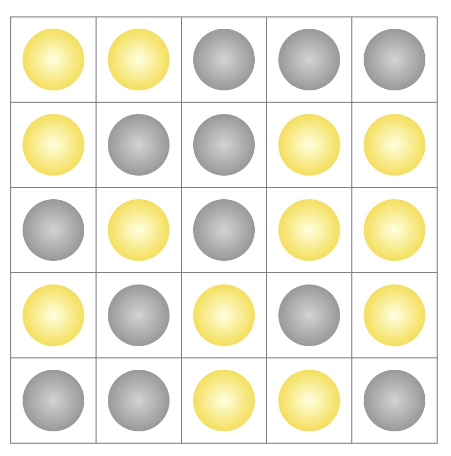

### Lights Out Games

**How to play**

The board has 25 lights, some are 'on' and some are 'off'. 
Clicking a light will toggle it (on to off, off to on). 
It will also toggle the 4 lights next to it(on the left, right, 
above and below it). To solve that puzzle, you have to turn off 
all the lights on the board.

#### Try it
[Play now](https://yuberdysheva.github.io/lights-out/)
 